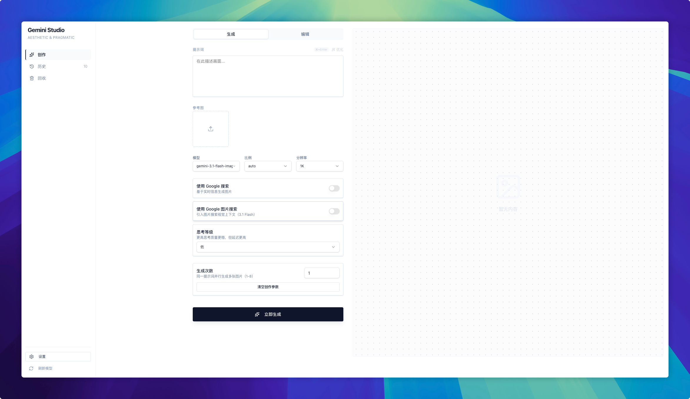
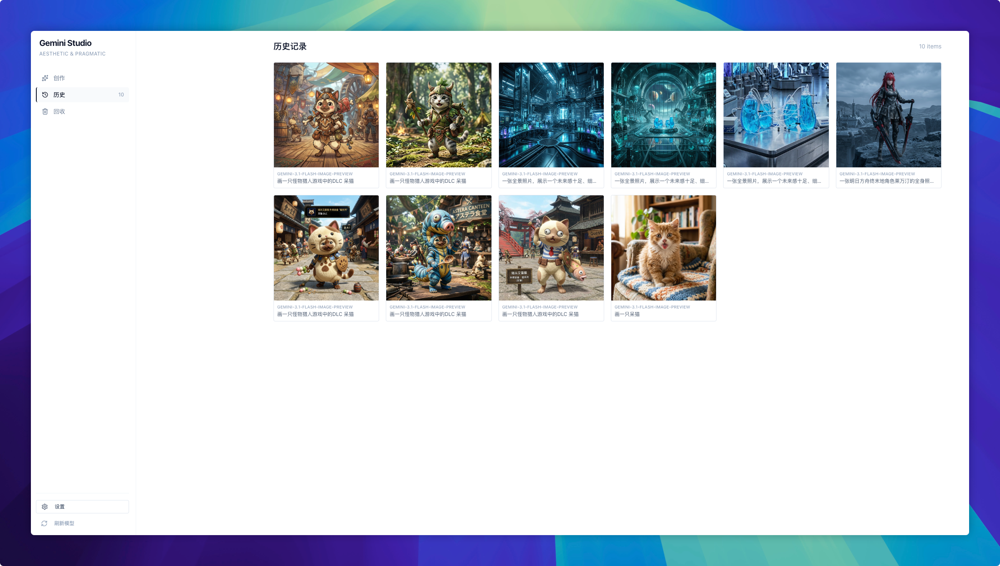
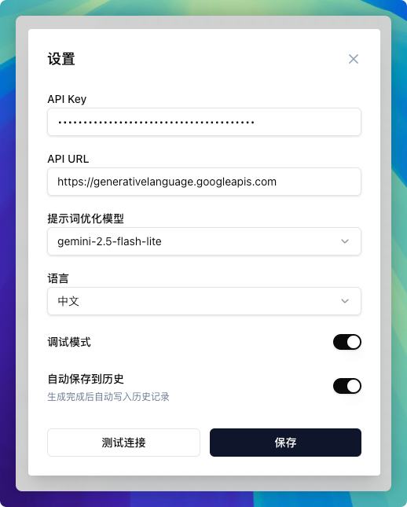

# AI Image Generator

An elegant AI image generation tool based on Google Gemini API, supporting text-to-image, image editing, and intelligent prompt optimization.


> 📄 Available in other languages: [简体中文](docs/zh-CN/README.md) | [日本語](docs/ja/README.md) | [한국어](docs/ko/README.md) | [Français](docs/fr/README.md) | [Deutsch](docs/de/README.md) | [Español](docs/es/README.md)

## Core Features

### Text-to-Image
Enter a description and generate stunning images. Supports various styles and scene descriptions.

### Intelligent Prompt Optimization
AI automatically optimizes your prompts for more accurate generation results.

### Flexible Parameter Adjustment
- **Multiple Aspect Ratios**: 1:1, 2:3, 3:2, 3:4, 4:3, 4:5, 5:4, 9:16, 16:9, 21:9
- **Multiple Resolutions**: 1K, 2K, 4K
- **Reference Images**: Upload reference images to guide generation direction

### Real-time Search Enhancement
Connect to Google Search for real-time information to assist image generation.

### Multi-language Support
Supports 7 languages: English, 简体中文, 日本語, 한국어, Français, Deutsch, Español. Language can be switched in settings, and prompt optimization will output in the corresponding language.

## Interface Preview

**Home** - Enter descriptions, adjust parameters, upload reference images, and generate AI images with one click.



**History** - Automatically saves all generation records for easy review and management of past works.



**Settings** - Configure API Key and preferences to customize your generation experience.



## Vercel Deployment

[](https://vercel.com/new/clone?repository-url=https://github.com/qunqin45/ai-img)

Click the button above for one-click free deployment to Vercel.

## Docker Deployment

Optimized for Linux x86_64 architecture, one-click deployment:

```bash
docker run -d --name ai-img --restart unless-stopped -p 3000:3000 qunqin45/ai-img:latest
```

Access at `http://<your-server-ip>:3000` after deployment.

Common commands:
```bash
docker logs -f ai-img   # View logs
docker restart ai-img   # Restart
docker stop ai-img && docker rm ai-img  # Stop and remove
```

## Quick Start

```bash
# Clone the project
git clone https://github.com/qunqin45/ai-img.git
cd ai-img

# Install dependencies
pnpm install

# Start development server
pnpm dev
```

Open [http://localhost:3000](http://localhost:3000) to start.

## Configuration

Fill in the following in the settings (top right corner):
- **API Key**: Your Gemini API key
- **API URL**: Gemini API address (optional)

API keys are only stored in your local browser.

## Tech Stack

    

## License

[MIT License](LICENSE)
